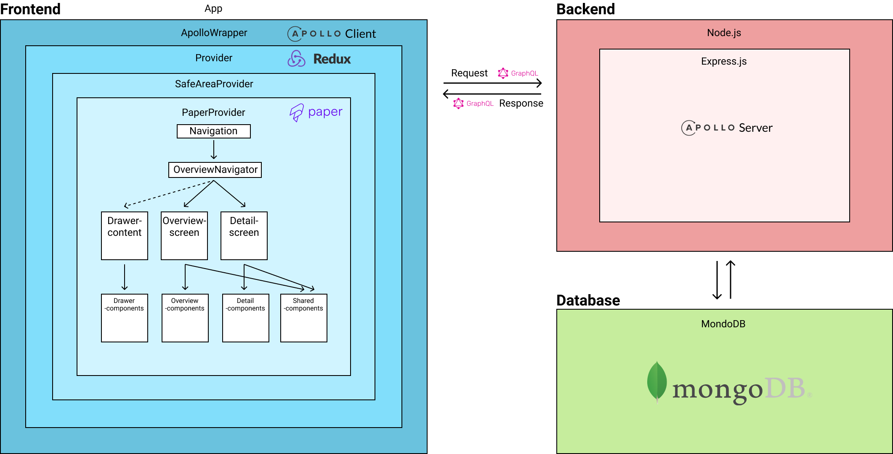

# WineEncyclopedia

<p align="center">
  
</p >
<p align="center">
  _...gif is loading_
</p>

**This project is the delivery for alternative A of project 4**

WineEncyclopedia is used for finding different kinds of beverages. The dataset is gathered from Vinmonopolets exposed, free CSV-file.
This can be done by searching on product names, including filtering on category, volume and price.
Each product can be clicked on and the site will then render a product screen showing more details about the chosen product. On the product site you can review products and see the reviews written by others.

## Run the project

### Prerequisites

- `Git`
- `Node` and `npm`
- `Expo CLI`

<br>

```
$ git clone https://gitlab.stud.idi.ntnu.no/it2810-h20/team-ad-hoc/project4-olestole.git
# You may be prompted for your GitLab-login (FEIDE)

$ cd project4-olestole
$ npm i
$ npm start
```

## Structure

**/root**: The root of the project. It contains the frontend seperated into multiple folders. There are also config-files, an env-file and a _package.json_ to keep track of the dependencies of the app <br>

<!-- - **/backend**
  - **/src**: Contains the backend logic. _index.ts_ starts the server and connects to the database. _resolver.ts_ and _typeDefs.ts_ contains Apollo GraphQL-specific logic for defining the available types and queries/mutations<br>
    - **/models**: Contains the different schemas contained in the database. These models are modelled using _Mongoose_ <br>
    - **/utils**: Utility-functions for the backend. It only contains a script for verifying JWT. Read more about [authentication](#authentication). <br> -->
<!-- - **/frontend** -->

- **/assets**: Contains assets and other static files hosted with the client<br>
- **/components**: Includes every component used by the application. The folder is divided into subfolders where every subfolder includes components (.tsx-files) related to that specific area of concern <br>
- **/constants**: Contains constants like _Colors_ used references throughout the project. <br>
- **/graphql**: Contains every GraphQL query/mutation, and their related, generated type-definitions in \_\_generated\_\_. <br>
- **/hooks**: Contains _Expo_-specific hooks, in addition to a custom hook `useProductList` which is referenced in `ProductList`. <br>
- **/navigation**: Contains the _Navigators_ which handles the app's routing. <br>
- **/screens**: Contains the different screens/routes <br>
- **/store**: Redux specific files
  - **/action**: Contains every action defined for redux <br>
  - **/reducer**: Contains the reducer used to update and mutate state <br>
  - **/types**: Contains redux-specific type-definitions <br>
- **/types**: Contains global TS-interfaces <br>
- **/utils**: Utility-functions for the frontend. It currently only contains a utility-file for `products`<br>

**Mentionable files:**

- **.env**: Environment variables used throughout the project. These would normally not be pushed to version control, but given the nature of peer-grading, it’s necessary that I reveal these
- **apollo.config.js**: Defines the connection to the remote _Apollo studio_.

# Tech Stack



**Important**: The source-code for the backend is not included in this project. The backend is running on a VM hosted by NTNU. The source-code is pretty much the same as in [project 3](https://gitlab.stud.iie.ntnu.no/it2810-h20/team-49/prosjekt3), but the frontend and some files were removed to make it as small as possible (given it would run on a VM). The source-code for the backend can be viewed [here](https://github.com/olestole/IT2810-VM-backend/)

I use a MERN stack with GraphQL. More specifically I use MongoDB, Express, React Native with Typescript and Node.js. In addition I am using Apollo Client on the frontend and Apollo server on the backend. We integrate Mongoose for interaction with MongoDB.

## Frontend

### React Native & Typescript

The project is written with React Native and Typescript. The project aims to follow well known good practices and keep the code modular. TypeScript is used in preference of JavaScript
as this enables me to reference the same types across multiple files, and avoid pain inducing run-time errors as the project grows.

### Redux (State Management)

I use Redux for frontend-specific state management. The global state helps me share state to components that have a larger area of concern than its local state. The AppState contains:

- `searchtext`: used to update the search. When the text is (empty) it will search for all items
- `filterOptions`: used for filtering the data
- `modalOpen`: used for keeping track of the product-review modal
- `currentProduct`: used to keep track of the selected product.
- `viewMode`: used to check if the data to be loaded should be appended or if the webapp should query a new set
- `addedReview`: used to implement _optimistic UI_ when adding reviews to a product.

#### Apollo Client & GraphQL

To retrieve data from the backend to the client I use Apollo Client. Apollo Client is a comprehensive state management library for JavaScript/TypeScript that enables me to manage both local and remote data with GraphQL. Apollo also makes it easy to generate the TypeScript-interfaces of every query and mutation with `apollo codegen`.

GraphQL enables the client to ask the backend for specific fields of data. This is convenient as it enables us to fetch exactly the data I need, instead of continuously over-/underfetch. An example of this is shown in the query `productsQuery`.
Instead of fetching all fields from the product I exclude fields like _Farge_, _Lukt_, _Smak_ as we’re not interested in those fields where I query these products.

#### Lazyloading

Lazy loading is implemented to make sure the client fetch feasible amounts of data - GraphQL and Apollo Client makes this easy.
The implementation of lazy loading (fetching additional data and adding it to the current dataset) is implemented in `/components/Overview/ProductListView` and `/hooks/product` using `fetchMore`. The `fetchmore` function runs each time you scroll to the bottom of the current dataset and will fetch 40 (or less/none based on the current search/filter settings) products.
This is done by passing in a new filterIndex, a variable the same as the length of the current list of data. To make this work I made our function for fetching data skip the provided index (in the database ignoring the items before the index), so I am actually using the same function for fetching data each time just with different variables.

## Testing

There wasn't a stated focus on testing in this project. Because of this I've only performed manual end-2-end tests. I've vigorously tested the application on multiple devices on both iOS and Android. There has been minor differences between how the different operating systems handles the code, but this has been resolved.

## Styling

### React Native Paper

As we were encouraged to use libraries for frontend, I chose to use some components from React Native Paper. React Native Paper is a UI-library that
contains a large set of customizable components, icons and themes. It implements the Material-UI and given the prior project implemented Material-UI it was easy to cross-implement.

All of the styling has been implemented through React Native's `Stylesheet.create()`. This consistency makes the code easier to read and more structured in contrast to using different styling implementations.

## Use of git

During the development I have described tasks usings issues in GitLab. I've used [Conventional Commits](https://www.conventionalcommits.org/en/v1.0.0/#summary) to make the [Git-log](https://gitlab.stud.iie.ntnu.no/it2810-h20/team-ad-hoc/project4-olestole/-/network/master) as readable and informative as possible. Branches has been prefixed with either _feature_ or _fix_. The merge requests (MR) reference issues that's solved by the given MR. The branches were all merged to master via MRs, and there's been no direct push to the master-branch.

## Known issues:

**Lazy loading**: There has been a problem with the implementation of lazy loading. You might be met by a **Expo CLI**-banner that states _"The updateQuery callback for fetchMore is deprecated"_. I've consulted multiple websites, forums and course-instructors, but there doesn't seem to be a good way to implement the lazy loading in another fashion. It doesn't cause a problem to the user experience.

**GraphQL Typescript Generator**: When starting the project you're met by "Validation of GraphQL query document failed". This is due to the project graph having multiple _variants_ and is not an issue.
